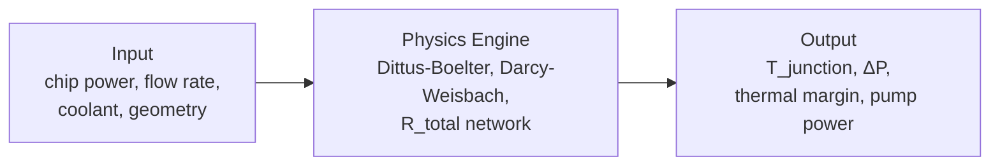

[](https://github.com/riccardovietri/thermal-mcp-server/actions/workflows/ci.yml)

# thermal-mcp-server

**An NVL72 rack dissipates 120 kW through liquid cooling. Choosing the wrong flow rate, coolant, or manifold configuration means thermal throttling (lost compute revenue) or overprovisioned cooling (wasted capex).** `thermal-mcp-server` quantifies these tradeoffs using a first-principles thermal resistance model exposed as an [MCP](https://modelcontextprotocol.io/) server.

## GPU Thermal Specs

| Chip | TDP (cold plate sizing) | Tj Design Ceiling | Source |
|------|------------------------|--------------------|--------|
| NVIDIA H100 SXM | 700 W | 83°C (throttle onset) | [NVIDIA H100 Datasheet](https://resources.nvidia.com/en-us-gpu-resources/h100-datasheet-24306) |
| NVIDIA B200 (NVL72) | 1,200 W | ~75°C (not NVIDIA-published) | [NVIDIA GB200 NVL72](https://www.nvidia.com/en-us/data-center/gb200-nvl72/), [SemiAnalysis](https://newsletter.semianalysis.com/p/gb200-hardware-architecture-and-component) |
| NVIDIA B200 (HGX standalone) | 1,000 W | Not published | [Lenovo ThinkSystem HGX B200 Product Guide](https://lenovopress.lenovo.com/lp2226-thinksystem-nvidia-b200-180gb-1000w-gpu) |
| AMD MI300X | 750 W | Not published | [AMD MI300X Data Sheet (PDF)](https://www.amd.com/content/dam/amd/en/documents/instinct-tech-docs/data-sheets/amd-instinct-mi300x-data-sheet.pdf) |
| Intel Gaudi 3 OAM | 900 W (air) / 1,200 W (liquid) | Not published | [Intel Gaudi 3 Product Brief (PDF)](https://cdrdv2-public.intel.com/817487/gaudi-3-ai-accelerator-hl-325l-oam-mezzanine-card-product-brief.pdf) |

> **Note:** TDP values are for cold plate thermal sizing, not electrical nameplate. The GB200 1,200 W figure reflects per-GPU heat dissipation in the NVL72 liquid-cooled configuration — not 120 kW / 72 amortized (which would include CPUs, NVSwitches, NICs, and VRM losses).

## Demo

Single H100 SXM cold plate analysis — 700 W, water, 10 LPM, 35°C inlet:

```python
from thermal_mcp_server.physics import analyze
from thermal_mcp_server.schemas import AnalyzeColdplateInput

result = analyze(AnalyzeColdplateInput(
    heat_load_w=700, flow_rate_lpm=10, inlet_temp_c=35.0, coolant="water"
))
```

```json
{
  "coolant": "water",
  "regime": "turbulent",
  "reynolds": 4667.6,
  "nusselt": 41.11,
  "heat_transfer_coeff_w_m2k": 24667.2,
  "pressure_drop_pa": 26503.0,
  "pump_power_w": 8.83,
  "coolant_rise_c": 1.01,
  "junction_temp_c": 80.69,
  "resistances_k_per_w": {
    "junction_to_case": 0.04,
    "tim": 0.02,
    "base_conduction": 0.00052,
    "convection": 0.00403,
    "total": 0.06455
  },
  "warnings": []
}
```

At 10 LPM water with 35°C inlet, the H100 runs at 80.7°C junction — 2.3°C of margin below the 83°C throttle point. This is a tight operating point at these inlet conditions; reducing inlet temperature to 25°C or increasing flow rate would add margin.

## How It Works

The physics engine models a single cold plate as a 1D thermal resistance network: junction-to-case (R_jc), thermal interface material (R_tim), copper base conduction, and forced convection to the coolant. Convective heat transfer uses the Dittus-Boelter correlation for turbulent flow and a constant Nu = 4.36 for laminar flow, with linear blending in the transition regime (Re 2300–4000). Pressure drop uses Darcy-Weisbach with Blasius friction factor, also blended through the transition regime. All assumptions — pump efficiency, channel geometry, property values — are documented inline in the source.



## Quick Start

```bash
git clone https://github.com/riccardovietri/thermal-mcp-server.git
cd thermal-mcp-server
pip install -e .
```

Configure in your MCP client (e.g., Claude Desktop `claude_desktop_config.json`):

```json
{
  "mcpServers": {
    "thermal": {
      "command": "python",
      "args": ["-m", "thermal_mcp_server"],
      "cwd": "/absolute/path/to/thermal-mcp-server"
    }
  }
}
```

See the [MCP documentation](https://modelcontextprotocol.io/) for client setup details.

## Tools

- **`analyze_coldplate`** — Single-point thermal and hydraulic analysis. Takes heat load, flow rate, inlet temperature, coolant type, and geometry. Returns junction temperature, thermal resistances, pressure drop, and pump power.

- **`compare_coolants`** — Runs `analyze_coldplate` for water and 50/50 glycol under identical conditions. Returns side-by-side junction temperature, pressure drop, and pump power for each coolant.

- **`optimize_flow_rate`** — Binary search for the minimum flow rate that keeps junction temperature at or below a target. Returns the minimum flow rate and the full thermal analysis at that operating point.

See [docs/mcp.md](docs/mcp.md) for full input/output schemas.

## Scope

This tool models steady-state, single-cold-plate performance. Rack-level manifold modeling and transient thermal response are on the roadmap.

**Roadmap:**
- Rack-level series/parallel manifold model (NVL72 validation target: 80 LPM, 120 kW, 1.5 bar max ΔP)
- Transient thermal response (power-on ramp, workload spikes)
- Coolant cost-performance comparison (water vs. glycol vs. engineered fluids)
- Flow maldistribution sensitivity analysis
