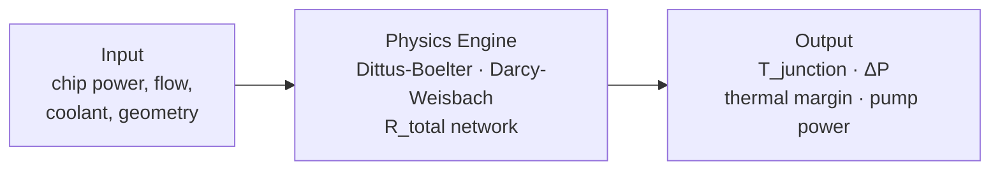

[](https://github.com/riccardovietri/thermal-mcp-server/actions/workflows/ci.yml)
[](https://pypi.org/project/thermal-mcp-server/)
[](https://pypi.org/project/thermal-mcp-server/)

# thermal-mcp-server

**A physics engine for liquid-cooled GPU systems, exposed as an AI-callable MCP server.** Ask Claude to size a CDU for an NVL72 rack, optimize flow rates for an H100 cluster, or compare water versus glycol — and get first-principles answers backed by hand-validated thermal models.

## Why This Exists

GPU power density has grown roughly 3× in two generations: H100 SXM at 700 W, B200 at 1,200 W. A single NVL72 rack dissipates 86.4 kW — more than most commercial HVAC systems handle. Liquid cooling is no longer optional; it is the critical path for AI compute density, and it is now the infrastructure constraint that determines whether a data center can host the next generation of hardware.

The tooling hasn't kept up. CDU sizing decisions get made with vendor charts, spreadsheets, and intuition. `thermal-mcp-server` is a first-principles thermal resistance model that an AI assistant can call directly — validated against published chip specs, honest about its assumptions, and designed to answer the questions that actually matter in a procurement conversation.

## Demo

Ask Claude natural-language questions. The server handles the physics.


### NVL72 CDU sizing — the procurement question

**The question:** *What's the minimum CDU flow rate to keep 72 B200 GPUs below 75°C junction temperature at 1,200 W each, with 25°C supply water?*

```python
from thermal_mcp_server.physics import optimize_flow, analyze_rack
from thermal_mcp_server.schemas import OptimizeFlowRateInput, AnalyzeRackInput, Geometry

# B200-specific cold plate geometry (engineering estimate; NVIDIA does not publish)
# 60 × 0.7 mm × 1.5 mm channels, 100 mm length, 160 cm² contact area
B200_PLATE = Geometry(
    channel_count=60, channel_width_m=0.7e-3, channel_height_m=1.5e-3,
    channel_length_m=0.10, base_thickness_m=1.5e-3,
    contact_area_m2=0.016, copper_k_w_mk=385.0,
)

# Find minimum flow per cold plate
opt = optimize_flow(OptimizeFlowRateInput(
    heat_load_w=1200, max_junction_temp_c=75.0,
    inlet_temp_c=25.0, coolant="water",
    r_jc_k_per_w=0.02, r_tim_k_per_w=0.015,  # B200 estimates
    geometry=B200_PLATE,
))
min_flow_per_gpu, analysis = opt
print(f"Minimum flow: {min_flow_per_gpu:.1f} LPM/GPU → {min_flow_per_gpu * 72:.0f} LPM total rack flow")

# Full rack spec at that flow
rack = analyze_rack(AnalyzeRackInput(
    gpu_count=72, topology="parallel",
    heat_load_per_gpu_w=1200, total_flow_lpm=min_flow_per_gpu * 72,
    cdu_supply_temp_c=25.0, coolant="water",
    r_jc_k_per_w=0.02, r_tim_k_per_w=0.015,
    geometry=B200_PLATE,
))
```

```
Minimum flow: 9.3 LPM/GPU → 671 LPM total rack flow

Rack spec at minimum flow:
  Max junction temp:   75.0°C  (at 75°C design limit)
  Cold plate ΔP:       0.096 bar  (cold plates only; add 20–50% for manifold)
  CDU return temp:     26.9°C
  Pump power:          214 W
  Total heat load:     86.4 kW
```

**What this tells a procurement team:** Minimum CDU flow spec is 671 LPM. Cold plate ΔP headroom is tight at 0.096 bar — real system ΔP with manifold and headers will be higher. With a 3°C design margin (target 72°C), the spec rises to 777 LPM at 0.141 bar.

### H100 SXM — validated baseline

```python
from thermal_mcp_server.physics import analyze
from thermal_mcp_server.schemas import AnalyzeColdplateInput

result = analyze(AnalyzeColdplateInput(
    heat_load_w=700, flow_rate_lpm=8.0, inlet_temp_c=25.0, coolant="water"
))
# junction_temp_c: 70.9  —  12.1°C margin below 83°C throttle onset
# regime: transitional  (Re ≈ 3734)
# pressure_drop_pa: 16800  (0.17 bar per cold plate)
```

This case is hand-calculation validated: every intermediate value — Reynolds number, Nusselt number, convection coefficient, pressure drop — is independently verified in `tests/test_physics_behavior.py`.

## How It Works

The physics engine models a cold plate as a 1D thermal resistance network:

```
T_junction = T_inlet + Q × (R_jc + R_tim + R_base + R_conv) + ΔT_coolant/2
```

- **R_jc / R_tim:** Package resistances (chip manufacturer spec or estimate)
- **R_base:** Copper base conduction (geometry + k = 385 W/m·K)
- **R_conv:** Forced convection, Dittus-Boelter (turbulent) or Nu = 4.36 (laminar), linearly blended through transition (Re 2,300–4,000)
- **ΔP:** Darcy-Weisbach with Blasius friction factor, same transition blend

Rack-level model stacks N single-GPU analyses in series (cumulative temperature rise) or parallel (uniform inlet, flow split) topology.


```mermaid
flowchart LR
    A["Input\nchip power, flow,\ncoolant, geometry"] --> B["Physics Engine\nDittus-Boelter · Darcy-Weisbach\nR_total network"]
    B --> C["Output\nT_junction · ΔP\nthermal margin · pump power"]
```

## Validation

Model outputs against published chip specs. All runs use water coolant, 25°C inlet.

| Chip | TDP | Tj Design Ceiling | Model Tj | Margin | Notes |
|------|-----|-------------------|----------|--------|-------|
| H100 SXM | 700 W | 83°C | **70.9°C** at 8 LPM | 12.1°C | Default geometry; hand-calc validated |
| MI300X | 750 W | ~85°C (proxy) | **74.2°C** at 8 LPM | ~10°C | AMD does not publish Tj_max |
| B200 NVL72 | 1,200 W | ~75°C (est.) | **75.0°C** at 9.3 LPM/GPU | 0°C at limit | R_jc=0.02 K/W est.; NVIDIA does not publish |
| Gaudi 3 OAM | 900 W (air) / 1,200 W (liquid) | ~85°C (proxy) | Requires B200-class geometry | — | Default H100 geometry undersized for 1,200 W |

> **On B200 and Gaudi 3 numbers:** NVIDIA and Intel do not publish cold plate geometry or R_jc for these chips. The B200 analysis uses an engineering estimate for cold plate geometry and package resistance. Treat as indicative; real procurement sizing requires vendor data.

Chip sources: [NVIDIA H100 Datasheet](https://resources.nvidia.com/en-us-gpu-resources/h100-datasheet-24306) · [NVIDIA GB200 NVL72](https://www.nvidia.com/en-us/data-center/gb200-nvl72/) · [SemiAnalysis B200 thermal estimates](https://newsletter.semianalysis.com/p/gb200-hardware-architecture-and-component) · [AMD MI300X Data Sheet](https://www.amd.com/content/dam/amd/en/documents/instinct-tech-docs/data-sheets/amd-instinct-mi300x-data-sheet.pdf) · [Intel Gaudi 3 Product Brief](https://cdrdv2-public.intel.com/817487/gaudi-3-ai-accelerator-hl-325l-oam-mezzanine-card-product-brief.pdf)

## Known Limitations

These are documented explicitly because they bound what the model can and cannot tell you:

- **No manifold or header pressure losses** — rack ΔP is cold-plate-only. Real system ΔP should add 20–50% for manifold losses. Do not use cold-plate ΔP as the CDU pump spec without this adder.
- **No heterogeneous racks** — all GPUs assumed identical TDP, geometry, and thermal resistance. Mixed-SKU racks require per-GPU analysis.
- **Steady-state only** — no transient thermal capacitance. Power-on ramps, burst workloads, and cooldown curves are not modeled.
- **Single-point fluid properties** — water and glycol50 properties are fixed at 25°C nominal. No correction for temperature rise along the flow path.
- **No flow maldistribution** — uniform flow assumed across all cold plates. Real parallel manifolds have ±10–30% flow variation depending on header design.

See [`docs/physics.md`](docs/physics.md) for the full physics documentation including equations and assumptions.

## Tools

- **`analyze_coldplate`** — Single-point thermal and hydraulic analysis. Returns junction temperature, full resistance breakdown, pressure drop, regime, and pump power.

- **`compare_coolants`** — Side-by-side water vs. 50/50 glycol comparison at identical conditions. Quantifies the thermal and hydraulic penalty of glycol for freeze-protection applications.

- **`optimize_flow_rate`** — Binary search for minimum flow rate to meet a junction temperature target. Returns the optimal flow and full thermal analysis at that point.

- **`analyze_rack`** — Rack-level model for N identical GPUs in series or parallel topology. Returns max junction temperature, per-GPU temperature list, total CDU flow requirement, system ΔP, pump power, and CDU return temperature.

See [`docs/mcp.md`](docs/mcp.md) for full input/output schemas and field definitions.

## Quick Start

**Install from PyPI:**

```bash
python -m venv thermal-venv
source thermal-venv/bin/activate
pip install thermal-mcp-server
```

Configure in your MCP client (`claude_desktop_config.json`):

```json
{
  "mcpServers": {
    "thermal": {
      "command": "/absolute/path/to/thermal-venv/bin/python",
      "args": ["-m", "thermal_mcp_server"]
    }
  }
}
```

> Use the absolute path to your venv Python. Claude Desktop does not inherit your shell's `PATH`.

**Install from source:**

```bash
git clone https://github.com/riccardovietri/thermal-mcp-server.git
cd thermal-mcp-server
python -m venv venv && source venv/bin/activate
pip install -e ".[dev]"
pytest  # 34 tests, all should pass
```

## Usage with Claude

Once configured, ask Claude engineering questions directly:

> *"I have 8 H100 SXM GPUs at 700 W each. Water cooling, 8 LPM per cold plate, 25°C CDU supply. What's the junction temperature and how much thermal margin do I have?"*

> *"What's the minimum flow rate to keep an H100 below 80°C at 30°C inlet temperature?"*

> *"Compare water versus 50/50 glycol for a 700 W load at 8 LPM — what's the Tj penalty of switching to glycol?"*

> *"Size a CDU for 8 H100 GPUs in a parallel manifold. I want to know total flow, system ΔP, and return water temperature."*

Claude calls the relevant tool, interprets the physics output, and answers in context. The MCP layer handles validation and error reporting; the physics stays in the Python API and is independently testable.

## Roadmap

- **Sensitivity and uncertainty output** — `margin_c` parameter for `optimize_flow_rate` targets Tj_p95 rather than nominal. ∂Tj/∂Q, ∂Tj/∂R_tim, ∂Tj/∂T_inlet available via `compute_sensitivity`. See [`examples/interactive_sizing.ipynb`](examples/interactive_sizing.ipynb) for worked examples.
- **ROI calculator** — financial layer: annual cooling cost delta between air and liquid, CDU payback period, per-GPU cooling tax as % of compute cost.
