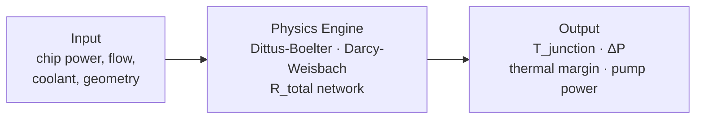

[](https://github.com/riccardovietri/thermal-mcp-server/actions/workflows/ci.yml)
[](https://pypi.org/project/thermal-mcp-server/)
[](https://pypi.org/project/thermal-mcp-server/)
[](https://colab.research.google.com/github/riccardovietri/thermal-mcp-server/blob/main/examples/interactive_sizing.ipynb)

# thermal-mcp-server

**A physics engine for liquid-cooled GPU systems, exposed as an AI-callable MCP server.** Ask Claude to size a cooling system for an H100 cluster, optimize cold plate flow rates, or compare water versus glycol — and get first-principles answers backed by hand-validated thermal models.

## Quick Start

**Try it now** — open the [interactive notebook in Colab](https://colab.research.google.com/github/riccardovietri/thermal-mcp-server/blob/main/examples/interactive_sizing.ipynb) to run NVL72 rack sizing, topology comparisons, and flow optimization interactively.

**Install and use as an MCP server:**

```bash
pip install thermal-mcp-server
```

Add to your MCP client config (`claude_desktop_config.json` for Claude Desktop):

```json
{
  "mcpServers": {
    "thermal": {
      "command": "python",
      "args": ["-m", "thermal_mcp_server"]
    }
  }
}
```

> **Note:** Claude Desktop does not inherit your shell's `PATH`. If the above doesn't work, use the absolute path to your Python binary (e.g. `/usr/local/bin/python` or the path inside a virtualenv).

Once configured, ask Claude engineering questions directly:

> *"I have 8 H100 SXM GPUs at 700 W each, water cooling at 8 LPM per cold plate, 25°C supply. What's the junction temperature and thermal margin?"*

> *"Compare water versus 50/50 glycol for a 700 W load at 8 LPM."*

> *"Size a CDU for 8 H100 GPUs in a parallel manifold — total flow, system ΔP, and return water temperature."*

Claude calls the relevant tool, interprets the physics, and answers in context.


*Claude Desktop calling `analyze_coldplate` via the MCP server. The user asks a natural-language thermal question; Claude picks the right tool, runs the physics, and interprets the result.*

## Example: H100 SXM Baseline

This is the hand-calculation validated reference case — every intermediate value (Reynolds number, Nusselt number, convection coefficient, pressure drop) is independently verified in `tests/test_physics_behavior.py`.

```python
from thermal_mcp_server.physics import analyze
from thermal_mcp_server.schemas import AnalyzeColdplateInput

result = analyze(AnalyzeColdplateInput(
    heat_load_w=700, flow_rate_lpm=8.0, inlet_temp_c=25.0, coolant="water"
))
print(f"Junction temp: {result.junction_temp_c:.1f}°C")   # 70.9°C
print(f"Thermal margin: {83 - result.junction_temp_c:.1f}°C below throttle onset")
print(f"Flow regime: {result.regime}")                      # transitional (Re ≈ 3734)
print(f"Pressure drop: {result.pressure_drop_pa:.0f} Pa")   # 16800 Pa (0.17 bar)
```

For rack-scale analysis (NVL72 CDU sizing, series vs. parallel topology, B200 at 1,200 W), see the [interactive notebook](https://colab.research.google.com/github/riccardovietri/thermal-mcp-server/blob/main/examples/interactive_sizing.ipynb).

## Tools

Four MCP tools, each also available as a Python function:

| Tool | What it does |
|------|-------------|
| `analyze_coldplate` | Single-point thermal + hydraulic analysis: Tj, resistance breakdown, ΔP, regime, pump power |
| `compare_coolants` | Side-by-side water vs. glycol at identical conditions |
| `optimize_flow_rate` | Binary search for minimum flow to meet a Tj target |
| `analyze_rack` | N identical GPUs in series or parallel: max Tj, per-GPU temps, total flow, system ΔP, CDU return temp |

See [`docs/mcp.md`](docs/mcp.md) for full input/output schemas.

## How It Works

The physics engine models a cold plate as a 1D thermal resistance network:

```
T_junction = T_inlet + Q × (R_jc + R_tim + R_base + R_conv) + ΔT_coolant/2
```

- **R_jc / R_tim:** Package resistances (chip manufacturer spec or estimate)
- **R_base:** Copper base conduction (geometry + k = 385 W/m·K)
- **R_conv:** Forced convection — Dittus-Boelter (turbulent) or Nu = 4.36 (laminar), linearly blended through transition (Re 2,300–4,000)
- **ΔP:** Darcy-Weisbach with Blasius friction factor, same transition blend

Rack-level model stacks N single-GPU analyses in series (cumulative temperature rise) or parallel (uniform inlet, flow split) topology.


```mermaid
flowchart LR
    A["Input\nchip power, flow,\ncoolant, geometry"] --> B["Physics Engine\nDittus-Boelter · Darcy-Weisbach\nR_total network"]
    B --> C["Output\nT_junction · ΔP\nthermal margin · pump power"]
```

See [`docs/physics.md`](docs/physics.md) for the full physics documentation including equations and assumptions.

## Validation

Model outputs against published chip specs. All runs use water coolant, 25°C inlet.

| Chip | TDP | Tj Design Ceiling | Model Tj | Margin | Notes |
|------|-----|-------------------|----------|--------|-------|
| H100 SXM | 700 W | 83°C | **70.9°C** at 8 LPM | 12.1°C | Default geometry; hand-calc validated |
| MI300X | 750 W | ~85°C (proxy) | **74.2°C** at 8 LPM | ~10°C | AMD does not publish Tj_max |
| B200 NVL72 | 1,200 W | ~75°C (est.) | **75.0°C** at 9.3 LPM/GPU | 0°C at limit | R_jc=0.02 K/W est.; NVIDIA does not publish |
| Gaudi 3 OAM | 900 W (air) / 1,200 W (liquid) | ~85°C (proxy) | Requires B200-class geometry | — | Default H100 geometry undersized for 1,200 W |

> **On B200 and Gaudi 3 numbers:** NVIDIA and Intel do not publish cold plate geometry or R_jc for these chips. The B200 analysis uses engineering estimates. Treat as indicative; real sizing requires vendor data.

Chip sources: [NVIDIA H100 Datasheet](https://resources.nvidia.com/en-us-gpu-resources/h100-datasheet-24306) · [NVIDIA GB200 NVL72](https://www.nvidia.com/en-us/data-center/gb200-nvl72/) · [SemiAnalysis B200 thermal estimates](https://newsletter.semianalysis.com/p/gb200-hardware-architecture-and-component) · [AMD MI300X Data Sheet](https://www.amd.com/content/dam/amd/en/documents/instinct-tech-docs/data-sheets/amd-instinct-mi300x-data-sheet.pdf) · [Intel Gaudi 3 Product Brief](https://cdrdv2-public.intel.com/817487/gaudi-3-ai-accelerator-hl-325l-oam-mezzanine-card-product-brief.pdf)

## Known Limitations

These are documented explicitly because they bound what the model can and cannot tell you:

- **No manifold or header pressure losses** — rack ΔP is cold-plate-only. Real system ΔP should add 20–50% for manifold losses.
- **No heterogeneous racks** — all GPUs assumed identical TDP, geometry, and thermal resistance.
- **Steady-state only** — no transient thermal capacitance.
- **Single-point fluid properties** — water and glycol50 properties fixed at 25°C nominal.
- **No flow maldistribution** — uniform flow assumed across all cold plates.

## Development

```bash
git clone https://github.com/riccardovietri/thermal-mcp-server.git
cd thermal-mcp-server
uv sync --group dev
uv run pytest -v  # 49 tests, all should pass
```

## Roadmap

- **Interactive demo polish** — expand the [Colab notebook](https://colab.research.google.com/github/riccardovietri/thermal-mcp-server/blob/main/examples/interactive_sizing.ipynb) with sensitivity outputs and clearer walkthrough
- **ROI calculator** — annual cooling cost delta between air and liquid, CDU payback period, per-GPU cooling cost
